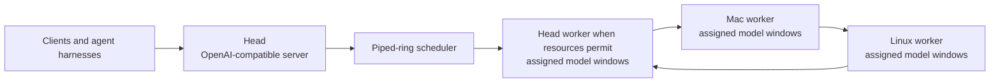

# potluck.cpp

**Several computers, one local server.**

`potluck.cpp` is intended to run one model across heterogeneous household
devices through a resource-aware piped ring. The head exposes one
OpenAI-compatible server and may also compute when current user activity leaves
safe CPU, memory, and accelerator capacity.

## Current product status

The binding product architecture is
[ADR 0006](dev/decisions/0006-piped-ring-server-product.md), with direct-ring
topology and communication fixed by
[ADR 0007](dev/decisions/0007-prima-direct-ring-zeromq.md). A finished Potluck
product requires one integrated path with:

- piped-ring execution only, with direct ZeroMQ communication between adjacent
  ring peers;
- automatic discovery, live profiling, device selection, and
  heterogeneity-aware window assignment;
- per-window prefetch and per-device CPU, CUDA, or Metal placement;
- HiGHS-solved heterogeneity-aware placement (prima's HALDA);
- speculative decoding and quantized GGUF model support;
- per-device complete GGUF files with window-bounded loading, while keeping
  resident memory proportional to assigned layers;
- continuous batching and isolated conversation slots;
- an OpenAI-compatible server on the head;
- a completion CLI beside the server, both driving one ring runtime;
- macOS and Linux support now, with Windows on the roadmap;
- head placement that reserves resources for the person using that machine.

The direct server path now owns the integrated ring data plane. `potluck-server`
connects each worker directly to its cyclic next peer with ZeroMQ, sends
ingress only to rank 0, and receives final results back at the head. HALDA
uses the live device profiles and HiGHS to select repeated disjoint windows
and per-window CPU, Metal, or CUDA placement. The route supports per-window
prefetch, speculative decoding, continuous batching, isolated slots, and
full-model window loading. It can launch local workers, discover advertised
LAN nodes through mDNS/DNS-SD, and launch discovered workers through SSH.

The completion CLI uses the same ring lifecycle as the server. The local
integrated suite verifies the direct ring, protocol, transport, HALDA,
speculative decoding, model loading, and HTTP paths. The supervised 27B
three-device operating point, assignment log, and measured streaming results
are recorded in [`docs/BENCHMARKS.md`](docs/BENCHMARKS.md). The release gate
still has open long-run recovery and broader model/API evidence; these are not
alternate Potluck execution paths.

Build and fixture commands in this repository are engineering checks only.
They do not describe a supported deployment.

Future development starts with the
[`dev/` documentation index](dev/README.md). This repository is self-contained;
the former `local-ai-network` patch archive is not a requirements or status
source.

## Architecture



The piped ring is the only Potluck execution architecture. Each selected
device can own several disjoint windows. Adjacent devices exchange hidden
states directly through ZeroMQ in ring order. The head participates as a ring
peer when assigned work, but it does not relay intermediate data for other
workers.
The finished scheduler must choose devices, windows, prefetch, and accelerator
placement from measured live capacity. It must account for current CPU and
memory pressure on the head before assigning work there.

Product workers receive one complete GGUF per selected device and load only
their assigned global layer windows. The controller may retain the source model,
but no production worker may load the complete model into memory.

Automatic operation is the default. Manual topology and worker selection are
not supported product behavior; the optional expert workload override in
[ADR 0010](dev/decisions/0010-prima-feature-parity-baseline.md) is the single
exception. The direct server path is the only current ring
path; any remaining static or disconnected implementation is a removal
target, not a mode or fallback.

## Quick start

Run the installer on every device. A source checkout builds the runtime and
installs it flat into `~/potluck`:

```sh
bash scripts/install.sh
```

On each worker device, run the installed Potluck node:

```sh
~/potluck/potluck-node
```

On the head device, start either front end. The server exposes the
OpenAI-compatible endpoint:

```sh
~/potluck/potluck-server -hf ggml-org/Qwen3.5-0.8B-GGUF
```

The completion CLI uses the same ring runtime:

```sh
~/potluck/potluck-cli -hf ggml-org/Qwen3.5-0.8B-GGUF -p "The capital of France is"
```

When a staged portable payload is available, install it on a worker without a
compiler or model copy:

```sh
bash scripts/install.sh --payload dist/mac-arm64
```

The payload must match the device platform. It includes the worker binaries,
the matching libzmq runtime, and checksums, but never a GGUF model. The head
fetches the selected model and ensures one digest-checked complete model file
is available on each selected device.

The server binds to `0.0.0.0` by default so trusted-LAN clients can connect.
Use `--host 127.0.0.1` (or another explicit address) to restrict the HTTP
listener. This is not a public-Internet security boundary; use an external
TLS boundary for Internet exposure.

For a bearer-protected HTTP endpoint, pass `--api-key VALUE`. Every method and
route, including `/health`, `/v1/models`, unknown paths, and `OPTIONS`, then
requires the exact `Authorization: Bearer VALUE` header. Pass
`--cors-origin https://client.example` to allow that one exact browser origin;
omitting it sends no CORS allow-origin header. Wildcard and credentialed CORS
are not supported.

First contact accepts a new SSH host key into
`$XDG_CONFIG_HOME/potluck/known_hosts` or `~/.config/potluck/known_hosts`.
Later key changes fail closed.

The model is not stored in this repository. The engineering fixture is pinned
to `ggml-org/Qwen3.5-0.8B-GGUF` (`Qwen3.5-0.8B-Q4_0.gguf`, SHA256 checked), and
`scripts/fetch-model.sh` downloads and verifies it on demand. Override the pin
with `POTLUCK_MODEL_HF_REPO`, `POTLUCK_MODEL_FILE`, or point at a local file
with `POTLUCK_TEST_MODEL`.

## Measured results

The local integrated suite exercises the direct adjacent-peer ZeroMQ ring,
protocol, transport, HALDA, window loading, speculative decoding, and HTTP
paths with the Qwen3.5 0.8B fixture. The supervised three-device Gemma 3 27B
operating point is recorded in [`docs/BENCHMARKS.md`](docs/BENCHMARKS.md).

The 27B result is a measured operating point, not a speedup claim or a
regression threshold. It includes automatic placement, repeated windows,
model distribution, per-window synchronization, and streamed HTTP output.
Component checks and one operating point do not establish full llama-server
API parity.

Full benchmark commands and raw output: [`docs/BENCHMARKS.md`](docs/BENCHMARKS.md).

## Verification scope

Small fixture checks establish token parity and component behavior. The
supervised Gemma 3 27B run establishes integrated three-device operation and a
measured performance point; it does not claim reference-token parity or a
speedup ratio. Broader model architectures and full llama-server API parity
remain outside this release baseline.

## Relationship to prima.cpp

[prima.cpp](https://github.com/OpenCPIL/prima.cpp) is Potluck's behavioral
progenitor for distributed inference. Potluck uses its direct peer-to-peer ring
behavior and ZeroMQ communication model. Other unresolved technical
distributed-runtime behavior also defers to prima.cpp's documented and coded
behavior. Potluck uses modern llama.cpp and complete-model window loading;
exact prima wire compatibility is not required.

Prima.cpp is not the user-flow template. Potluck's usability north star is one
easy local server: select a model, let the controller discover and operate the
available computers, and connect an ordinary OpenAI-compatible client or agent
harness. Users do not manage ranks, workers, topology, windows, model files,
bounds, weights, ports, or launch commands. The optional expert workload
[ADR 0010](dev/decisions/0010-prima-feature-parity-baseline.md) is the single
exception; automatic scheduling stays the default.

Any new technical departure from prima.cpp requires explicit user approval and
an accepted ADR. The complete authority order is documented in
[`dev/README.md`](dev/README.md).

Credit also belongs to [llama.cpp](https://github.com/ggml-org/llama.cpp), the
modern inference engine and backend base.

## Current implementation gaps

The integrated implementation now covers the ADR 0010 feature baseline:

- HALDA uses live device profiles and HiGHS to solve heterogeneous windows,
  accelerator layers, and device exclusion.
- Per-window prefetch, full-model distribution, lazy window loading, CPU,
  Metal, and CUDA placement, continuous batching, isolated slots, and
  speculative decoding use the same ring runtime.
- `potluck-server` and `potluck-cli` share the controller, worker, scheduler,
  model, and recovery code.
- CURVE protects direct ring peers, and the HTTP API supports the accepted
  bearer-key and exact-origin controls for a trusted LAN.

The remaining gaps are broader llama-server API parity, wider distributed
model and modality coverage, adaptive token-state migration after a worker
change, and additional long-running multi-device acceptance measurements.
These are separate release work, not alternate execution paths.

## Verification

```sh
cmake -B build -DCMAKE_BUILD_TYPE=Release -DLLAMA_BUILD_TESTS=ON -DPOTLUCK_HIGHS=ON
cmake --build build -j10
bash tests/potluck/run_all.sh
```

GitHub Actions no longer runs the Potluck build on pushes. Install the
repository-managed local pre-push hook once per checkout:

```sh
bash scripts/install-git-hooks.sh
```

The hook runs `scripts/pre-push-check.sh`: it configures a release build with
HiGHS enabled, builds the required binaries, and runs
`tests/potluck/run_all.sh`. The test model is fetched automatically from the
pinned Hugging Face source when missing; set `POTLUCK_TEST_MODEL` to use a
local copy. Run the check script directly to verify the same gate without
pushing.

See [`dev/parity-and-accuracy.md`](dev/parity-and-accuracy.md) for the
distinction between inference accuracy and feature coverage.
