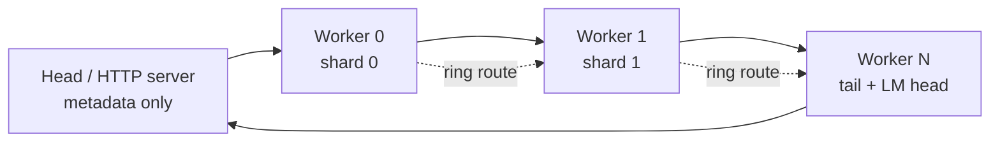

# potluck.cpp

**Everyone brings a few layers.**

`potluck.cpp` runs a Qwen3.5 layer pipeline across machines. Each worker stores and computes one layer shard; no device needs a full model copy.

## 60-second quickstart

```sh
git clone git@github.com:carl-stone/potluck.cpp.git
cd potluck.cpp
cmake -B build -DCMAKE_BUILD_TYPE=Release -DLLAMA_BUILD_TESTS=ON -DPOTLUCK_HIGHS=ON
cmake --build build -j10 --target potluck-shard potluck-server potluck-worker potluck-head

# Start with the 0.8B fixture.
mkdir -p /tmp/potluck-shards
build/bin/potluck-shard models/Qwen3.5-0.8B-Q4_0.gguf --parts 2 -o /tmp/potluck-shards

# This local form is for tests. It does not create extra memory or cluster capacity.
build/bin/potluck-server \
  -m models/Qwen3.5-0.8B-Q4_0.gguf \
  --shard-dir /tmp/potluck-shards --workers 2 --port 8080
```

Send a request:

```sh
curl -s http://127.0.0.1:8080/v1/chat/completions \
  -H 'Content-Type: application/json' \
  -d '{"messages":[{"role":"user","content":"What is layer parallelism?"}],"max_tokens":32,"reasoning_effort":"none"}'
```

For separate machines, copy one shard and `potluck-worker` to each host with `scripts/deploy.sh`, then use the server's `--hosts host-a,host-b --launch ssh` path. Manual workers plus a workers file remain available for non-SSH networks.

## Architecture



The default route is a contiguous static pipeline. `potluck-head --ring` enables piped-ring routing, where each worker owns several disjoint windows. The wire protocol is versioned PTLK/TCP protocol version 5. The server renders chat templates with llama.cpp's common chat implementation, tokenizes with the model vocabulary, and returns OpenAI-compatible JSON or SSE.

## Measured results

Measurements below use Apple Mac16,1, Apple M4, 10 cores, 16 GiB unified memory, Darwin 25.5.0, and the 526.50 MiB `Qwen3.5-0.8B-Q4_0.gguf` fixture. The two workers run on the same host and are a test harness, not a scale-out result.

| Command | Hardware | Result |
|---|---|---|
| `potluck-server -m models/Qwen3.5-0.8B-Q4_0.gguf --workers 2 --bench` | M4, 2 local CPU workers | Prefill 129.01 tok/s; decode 81.11 tok/s; 17.17 ms/token; 75.0 wire B/token; worker peak RSS 1109.5 MiB |
| `potluck-head models/Qwen3.5-0.8B-Q4_0.gguf workers.txt 8 --bench` | M4, 2 local CPU workers | Prefill 170.90 tok/s; decode 80.03 tok/s; 16.88 ms/token; 30.0 wire B/token; worker peak RSS 1112.5 MiB |
| `bash tests/potluck/test_server.sh 2 4` | M4, 0.8B fixture | Prompt, error, health, models, llama-cli parity, and SSE checks passed |
| `bash tests/potluck/run_all.sh` | M4, 0.8B fixture | Full 17-test acceptance suite; rerun this command after a source change |

Full benchmark commands and raw output: [`docs/BENCHMARKS.md`](docs/BENCHMARKS.md).

A 27B result is not published. The 18.97 GB Q4 model is **unverified and remote-only** for this 16 GiB M4. A real 27B proof requires separate machines with enough aggregate memory and disk.

## How this differs from prima.cpp

| | potluck.cpp | prima.cpp |
|---|---|---|
| **Per-device model storage** | **One window shard per device; no per-device full model copy** | Full GGUF copy on each device in the documented deployment |
| Transport | Versioned raw TCP PTLK protocol | ZeroMQ-based reference transport |
| Pipeline | Static contiguous windows plus optional piped ring | Piped-ring runtime |
| Front end | `potluck-server`, `/completion`, `/v1/chat/completions`, SSE | CLI-centered distributed driver |
| Model support | Modern llama.cpp window hooks; Qwen3.5 dense path | Older forked ggml snapshot |

Credit and context: [prima.cpp](https://github.com/OpenCPIL/prima.cpp) and [llama.cpp](https://github.com/ggml-org/llama.cpp). This project keeps the modern llama.cpp base and uses a separate TCP transport rather than copying the old ZeroMQ integration.

## Limitations

- The layer-window model path currently targets the Qwen3.5 dense (`qwen35`) architecture.
- Supported host platforms are Linux and macOS.
- The LAN is trusted. There is no authentication or encryption.
- One chain serves one request at a time; the server returns HTTP 429 while busy.
- Same-machine workers are for tests or multiple physical accelerators. They do not create memory and do not represent multi-machine throughput.
- `--parity-check` is an explicit full-model correctness harness. Without it, the head loads metadata only and does not load the whole model.
- 27B performance and end-to-end completion remain unverified until separate machines are available.

## Verification

```sh
cmake -B build -DCMAKE_BUILD_TYPE=Release -DLLAMA_BUILD_TESTS=ON -DPOTLUCK_HIGHS=ON
cmake --build build -j10
bash tests/potluck/run_all.sh
```

CI builds Linux and macOS with `POTLUCK_HIGHS=OFF`; local HiGHS is enabled because its CMake FetchContent dependency needs network access. See [`dev/parity-and-accuracy.md`](dev/parity-and-accuracy.md) for the distinction between inference accuracy and feature coverage.
