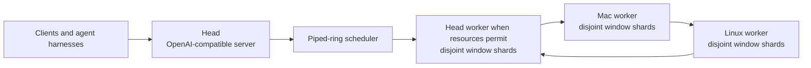

# potluck.cpp

**Several computers, one local server.**

`potluck.cpp` is intended to run one model across heterogeneous household
devices through a resource-aware piped ring. The head exposes one
OpenAI-compatible server and may also compute when current user activity leaves
safe CPU, memory, and accelerator capacity.

## Current product status

The binding product architecture is
[ADR 0006](dev/decisions/0006-piped-ring-server-product.md), with direct-ring
topology and communication fixed by
[ADR 0007](dev/decisions/0007-prima-direct-ring-zeromq.md). A finished Potluck
product requires one integrated path with:

- piped-ring execution only, with direct ZeroMQ communication between adjacent
  ring peers;
- automatic discovery, live profiling, device selection, and
  heterogeneity-aware window assignment;
- per-window prefetch and per-device CPU, CUDA, or Metal placement;
- per-device GGUF shard loading, while allowing a complete model to exist on
  disk;
- continuous batching and isolated conversation slots;
- an OpenAI-compatible server on the head;
- head placement that reserves resources for the person using that machine.

The current source does not yet provide this product. Its server still uses a
static, manually placed, single-request chain; its ring, profiling, batching,
and HTTP capabilities are separate paths. Those paths must be replaced by the
integrated ring server. There is no provisional product quickstart until that
cutover is complete.

Build and fixture commands in this repository are engineering checks only.
They do not describe a supported deployment.

Future development starts with the
[`dev/` documentation index](dev/README.md). This repository is self-contained;
the former `local-ai-network` patch archive is not a requirements or status
source.

## Architecture



The piped ring is the only Potluck execution architecture. Each selected
device can own several disjoint windows. Adjacent devices exchange hidden
states directly through ZeroMQ in ring order. The head participates as a ring
peer when assigned work, but it does not relay intermediate data for other
workers. The scheduler chooses devices, windows, prefetch, and accelerator
placement from measured live capacity. It must account for current CPU and
memory pressure on the head before assigning work there.

Workers load only their assigned GGUF window shards. A full model may be
downloaded or retained on a device, but no production worker loads the complete
model.

Static contiguous execution, equal or manual bounds, manual worker topology,
and a ring CLI disconnected from the server are unfinished legacy code. They
must be removed rather than retained as modes or fallbacks.

## Measured results
These measurements cover component and regression paths in the unfinished
implementation. They are not product benchmarks and do not satisfy the
piped-ring server release gate.


Measurements below use Apple Mac16,1, Apple M4, 10 cores, 16 GiB unified memory, Darwin 25.5.0, and the 526.50 MiB `Qwen3.5-0.8B-Q4_0.gguf` fixture. The two workers run on the same host and are a test harness, not a scale-out result.

| Command | Hardware | Result |
|---|---|---|
| `potluck-server -m models/Qwen3.5-0.8B-Q4_0.gguf --workers 2 --bench` | M4, 2 local CPU workers | Prefill 129.01 tok/s; decode 81.11 tok/s; 17.17 ms/token; 75.0 wire B/token; worker peak RSS 1109.5 MiB |
| `potluck-head models/Qwen3.5-0.8B-Q4_0.gguf workers.txt 8 --bench` | M4, 2 local CPU workers | Prefill 170.90 tok/s; decode 80.03 tok/s; 16.88 ms/token; 30.0 wire B/token; worker peak RSS 1112.5 MiB |
| `bash tests/potluck/test_server.sh 2 4` | M4, 0.8B fixture | Prompt, error, health, models, llama-cli parity, and SSE checks passed |
| `bash tests/potluck/run_all.sh` | M4, 0.8B fixture | Historical 18-check component suite; not the product release gate |

Full benchmark commands and raw output: [`docs/BENCHMARKS.md`](docs/BENCHMARKS.md).

## Verification scope

Component correctness is checked with small model files that fit the test host.
The current fixture is Qwen3.5 0.8B; other small fixtures may exercise a
supported primitive. Verifying 27B correctness, performance, or
end-to-end execution is an explicit non-goal. 27B is a deployment target, not
an acceptance target.

## Relationship to prima.cpp

[prima.cpp](https://github.com/OpenCPIL/prima.cpp) is Potluck's behavioral
progenitor for distributed inference. Potluck uses its direct peer-to-peer ring
behavior and ZeroMQ communication model. Other unresolved technical
distributed-runtime behavior also defers to prima.cpp's documented and coded
behavior. Potluck uses modern llama.cpp and per-window GGUF shard loading; exact
prima wire compatibility is not required.

Prima.cpp is not the user-flow template. Potluck's usability north star is one
easy local server: select a model, let the controller discover and operate the
available computers, and connect an ordinary OpenAI-compatible client or agent
harness. Users do not manage ranks, workers, topology, windows, shards, bounds,
weights, ports, or launch commands.

Any new technical departure from prima.cpp requires explicit user approval and
an accepted ADR. The complete authority order is documented in
[`dev/README.md`](dev/README.md).

Credit also belongs to [llama.cpp](https://github.com/ggml-org/llama.cpp), the
modern inference engine and backend base.

## Current implementation gaps

- `potluck-server` still executes a static contiguous chain. This path is
  against the product architecture and must be removed.
- `potluck-head --ring` proves coordinator-relayed routing over custom
  PTLK/raw TCP. It is disconnected from the client-facing server and conflicts
  with the required direct peer-to-peer ZeroMQ ring.
- Device profiling, selection, placement, prefetch, and offload are optional or
  manually connected instead of one automatic runtime.
- The current prefetch path warms a model file, not the next assigned ring
  window.
- Accelerator planning does not independently adapt every device and window.
- Shard creation, transfer, and selection are manual.
- One chain serves one request at a time and returns HTTP 429 while busy.
- The server has no conversation slots, cache affinity, or continuous HTTP
  batching.
- The HTTP surface is only an OpenAI-like subset and silently ignores some
  unsupported fields.
- The distributed graph currently targets Qwen3.5 dense (`qwen35`).
- The current raw-TCP transport has no authentication or encryption and must be
  replaced by the required ZeroMQ communication model. ZeroMQ authentication
  and encryption remain separate security work.

These are not acceptable product limitations or staged release modes. The
product is unfinished until the complete
[ADR 0006](dev/decisions/0006-piped-ring-server-product.md) contract passes as
one server path.

## Verification

```sh
cmake -B build -DCMAKE_BUILD_TYPE=Release -DLLAMA_BUILD_TESTS=ON -DPOTLUCK_HIGHS=ON
cmake --build build -j10
bash tests/potluck/run_all.sh
```

GitHub Actions no longer runs the Potluck build on pushes. Install the
repository-managed local pre-push hook once per checkout:

```sh
bash scripts/install-git-hooks.sh
```

The hook runs `scripts/pre-push-check.sh`: it configures a release build with
`POTLUCK_HIGHS=OFF`, builds the required binaries with two parallel jobs, and
runs `tests/potluck/run_all.sh`. The ignored
`models/Qwen3.5-0.8B-Q4_0.gguf` fixture must exist locally, or
`POTLUCK_TEST_MODEL` must point to it. Run the check script directly to verify
the same gate without pushing.

See [`dev/parity-and-accuracy.md`](dev/parity-and-accuracy.md) for the
distinction between inference accuracy and feature coverage.
