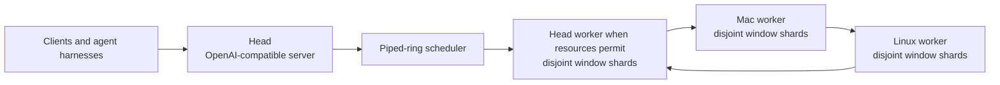

# potluck.cpp

**Several computers, one local server.**

`potluck.cpp` is intended to run one model across heterogeneous household
devices through a resource-aware piped ring. The head exposes one
OpenAI-compatible server and may also compute when current user activity leaves
safe CPU, memory, and accelerator capacity.

## Current product status

The binding product architecture is
[ADR 0006](dev/decisions/0006-piped-ring-server-product.md), with direct-ring
topology and communication fixed by
[ADR 0007](dev/decisions/0007-prima-direct-ring-zeromq.md). A finished Potluck
product requires one integrated path with:

- piped-ring execution only, with direct ZeroMQ communication between adjacent
  ring peers;
- automatic discovery, live profiling, device selection, and
  heterogeneity-aware window assignment;
- per-window prefetch and per-device CPU, CUDA, or Metal placement;
- per-device GGUF shard loading, while allowing a complete model to exist on
  disk;
- continuous batching and isolated conversation slots;
- an OpenAI-compatible server on the head;
- head placement that reserves resources for the person using that machine.

The direct server path now owns the implemented ring data plane. `potluck-server`
connects each worker directly to its cyclic next peer with ZeroMQ, sends
ingress only to rank 0, and receives final results back at the head. The
current route assigns two repeated disjoint windows per worker where the model
layers permit. It can launch local workers, discover advertised LAN nodes with
mDNS/DNS-SD, and launch discovered workers through SSH. Each worker reports its
accelerator through the ring, and the head places window layers on Metal or
CUDA automatically from that profile.

Local two-worker smoke passed with automatic placement: window layers fully on
M4 Metal and on a GTX 1650 SUPER CUDA device. Live device selection and
admission, heterogeneous window sizing, shard automation, batching, slots,
recovery, security, and full API parity remain unfinished, so Potluck is not
complete.

Build and fixture commands in this repository are engineering checks only.
They do not describe a supported deployment.

Future development starts with the
[`dev/` documentation index](dev/README.md). This repository is self-contained;
the former `local-ai-network` patch archive is not a requirements or status
source.

## Architecture



The piped ring is the only Potluck execution architecture. Each selected
device can own several disjoint windows. Adjacent devices exchange hidden
states directly through ZeroMQ in ring order. The head participates as a ring
peer when assigned work, but it does not relay intermediate data for other
workers.
The finished scheduler must choose devices, windows, prefetch, and accelerator
placement from measured live capacity. It must account for current CPU and
memory pressure on the head before assigning work there.

Product workers must load only their assigned GGUF window shards. A full model
may be downloaded or retained on a device, but no production worker may load
the complete model.

Manual topology, bounds, and worker or shard selection are not supported
product behavior. The direct server path is the only current ring path; any
remaining static or disconnected implementation is a removal target, not a
mode or fallback.

## Quick start

One command prepares any macOS or Linux device. It checks build tools, builds
the runtime, fetches the pinned fixture model, and installs everything flat
into `~/potluck`:

```sh
bash scripts/install.sh
```

Then:

- Worker device: run `~/potluck/potluck-node`. It advertises the node over
  DNS-SD until stopped. Keep the default prefix on workers; the head launches
  workers there.
- Head device: run
  `~/potluck/potluck-server -m ~/potluck/Qwen3.5-0.8B-Q4_0.gguf`. The head
  discovers advertised nodes, launches their workers over SSH, and serves the
  OpenAI-like HTTP surface.

First contact accepts a new SSH host key into
`$XDG_CONFIG_HOME/potluck/known_hosts` or `~/.config/potluck/known_hosts`.
Later key changes fail closed.

The model is not stored in this repository. The engineering fixture is pinned
to `ggml-org/Qwen3.5-0.8B-GGUF` (`Qwen3.5-0.8B-Q4_0.gguf`, SHA256 checked), and
`scripts/fetch-model.sh` downloads and verifies it on demand. Override the pin
with `POTLUCK_MODEL_HF_REPO`, `POTLUCK_MODEL_FILE`, or point at a local file
with `POTLUCK_TEST_MODEL`. This remains an engineering smoke path, not a
supported deployment.

## Measured results
These observations are functional smoke evidence for the unfinished direct
server implementation. They are not product benchmarks and do not satisfy the
resource-aware piped-ring server release gate.

The fixture was `Qwen3.5-0.8B-Q4_0.gguf`. The local smoke ran on an Apple M4
with two local CPU workers. The remote smoke used an M4 head as controller and
one Linux CPU worker advertised with `potluck-node`; it did not exercise
heterogeneous head computation or automatic placement.

| Path | Hardware | Result |
|---|---|---|
| `potluck-server` local ring | M4, 2 local CPU workers | Direct adjacent-peer ZeroMQ ring; two repeated windows per worker; a two-token completion returned ` located in` |
| `potluck-server` automatic discovery | M4 head, 1 Linux CPU worker | DNS-SD discovery, scoped SSH trust-on-first-use, SSH launch, and direct ring inference succeeded; the same two-token completion returned ` located in` |

These smokes establish candidate discovery and the direct server transport and
launch boundaries only. They do not establish live profiling or admission,
heterogeneity-aware selection and placement, shard automation, continuous
batching, slots, resilience, public-network security, or full API parity.

Full benchmark commands and raw output: [`docs/BENCHMARKS.md`](docs/BENCHMARKS.md).

## Verification scope

Component correctness is checked with small model files that fit the test host.
The current fixture is Qwen3.5 0.8B; other small fixtures may exercise a
supported primitive. Verifying 27B correctness, performance, or
end-to-end execution is an explicit non-goal. 27B is a deployment target, not
an acceptance target.

## Relationship to prima.cpp

[prima.cpp](https://github.com/OpenCPIL/prima.cpp) is Potluck's behavioral
progenitor for distributed inference. Potluck uses its direct peer-to-peer ring
behavior and ZeroMQ communication model. Other unresolved technical
distributed-runtime behavior also defers to prima.cpp's documented and coded
behavior. Potluck uses modern llama.cpp and per-window GGUF shard loading; exact
prima wire compatibility is not required.

Prima.cpp is not the user-flow template. Potluck's usability north star is one
easy local server: select a model, let the controller discover and operate the
available computers, and connect an ordinary OpenAI-compatible client or agent
harness. Users do not manage ranks, workers, topology, windows, shards, bounds,
weights, ports, or launch commands.

Any new technical departure from prima.cpp requires explicit user approval and
an accepted ADR. The complete authority order is documented in
[`dev/README.md`](dev/README.md).

Credit also belongs to [llama.cpp](https://github.com/ggml-org/llama.cpp), the
modern inference engine and backend base.

## Current implementation gaps

The direct adjacent-peer ZeroMQ ring now runs inside `potluck-server`, but its
bootstrap and scheduling are still explicit and incomplete:

- The current route uses two repeated disjoint windows per worker where layers
  permit; it does not yet select windows from live heterogeneous capability or
  current resource pressure.
- DNS-SD candidate discovery and automatic SSH launch work, but live profiling,
  admission, selection, placement, and topology lifecycle do not.
- Per-window prefetch and independent CPU, CUDA, or Metal placement are not
  implemented.
- Shard creation, transfer, validation, selection, and caching are not
  automated.
- The server still serializes HTTP work instead of providing continuous
  batching and isolated conversation slots.
- The HTTP surface is only an OpenAI-like subset; full request, response,
  error, usage, streaming, and cancellation parity is unfinished.
- Worker failure handling lacks reconnect, ring rebuild, slot migration, and
  safe retry behavior.
- Authentication, encryption, credential handling, and tenant or prompt
  privacy controls are unfinished. The deployment boundary remains a trusted
  LAN.
- The distributed graph currently targets Qwen3.5 dense (`qwen35`).

These are not acceptable product limitations or staged release modes. The
product is unfinished until the complete
[ADR 0006](dev/decisions/0006-piped-ring-server-product.md) contract passes as
one server path.

## Verification

```sh
cmake -B build -DCMAKE_BUILD_TYPE=Release -DLLAMA_BUILD_TESTS=ON -DPOTLUCK_HIGHS=ON
cmake --build build -j10
bash tests/potluck/run_all.sh
```

GitHub Actions no longer runs the Potluck build on pushes. Install the
repository-managed local pre-push hook once per checkout:

```sh
bash scripts/install-git-hooks.sh
```

The hook runs `scripts/pre-push-check.sh`: it configures a release build with
`POTLUCK_HIGHS=OFF`, builds the required binaries with two parallel jobs, and
runs `tests/potluck/run_all.sh`. The test model is fetched automatically from
the pinned Hugging Face source when missing; set `POTLUCK_TEST_MODEL` to use a
local copy. Run the check script directly to verify the same gate without
pushing.

See [`dev/parity-and-accuracy.md`](dev/parity-and-accuracy.md) for the
distinction between inference accuracy and feature coverage.
